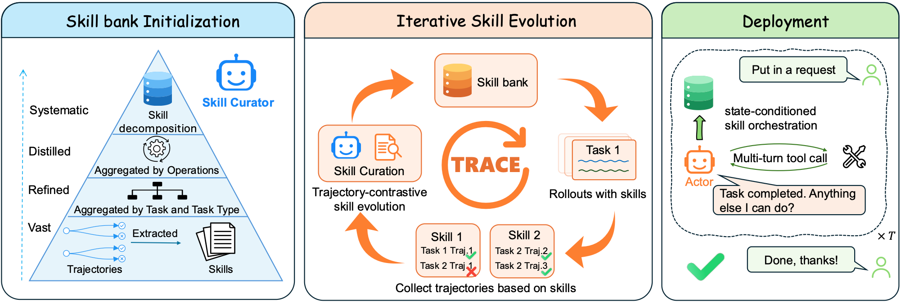

# CAR-bench Skill-Bank Agent — Darwin Agent Team

## IJCAI-ECAI 2026 Competition Track 1

<p align="center">
<a href="https://car-bench.github.io/car-bench/leaderboard.html"></a>
<a href="https://darwin-agent.github.io/Car-bench-TRACE/"></a>
<a href="https://arxiv.org/abs/2608.22793"></a>
</p>

本仓库是 Darwin Agent Team 参加 IJCAI-ECAI 2026 CAR-bench Competition Track 1 的方案。项目基于原始的 [CAR-bench](https://github.com/CAR-bench/car-bench-ijcai)，通过构建可复用的领域知识 skill bank，提升 agent 在复杂、不确定的车载语音任务中的可靠性。

## 概览

CAR-bench evaluator 负责模拟用户、维护车辆和环境状态、提供工具、执行工具调用以及计算评测分数。Track 1 agent 负责理解策略和用户请求、维护每个 `context_id` 的对话状态、检索相关 skills，并返回用户可见文本或工具调用。

```text
CAR-bench evaluator
  ├─ 策略和用户消息
  ├─ 可用工具
  └─ 工具结果
          │ A2A 消息
          ▼
Track 1 agent
  ├─ 按 context_id 保存对话历史
  ├─ skill selector
  ├─ 注入选中的 skills
  └─ LiteLLM 模型回复或工具调用
```

agent 不会直接执行 CAR-bench 工具，而是通过 A2A 返回工具调用请求，由 evaluator 执行工具，并在下一回合返回工具结果。这保持了原始项目定义的评测边界。

## 环境准备

项目需要 Python 3.11+、uv。首先创建并激活 Python 环境：

```bash
python3.11 -m venv .venv
source .venv/bin/activate
```

使用项目提供的脚本准备原始 CAR-bench 仓库：

```bash
./setup_car_bench.sh
```

安装 Track 1 agent、evaluator 和 skill optimizer 所需的依赖：

```bash
uv sync \
  --extra track-1-agent \
  --extra car-bench-evaluator \
  --extra skill-optimizer
```

在 shell 或本地 `.env` 文件中配置 evaluator 和 agent 所需的模型凭据。例如：

```bash
GEMINI_API_KEY=...
OPENAI_API_KEY=...
```

## 测试与 skill bank 演化



### Skill Bank

仓库中提供了两个可以复现和比较的 skill bank 版本：

- `skills_bank_v0/`：初始 skill bank。
- `skills_bank/`：经过轨迹驱动优化后的最终 skill bank。

每个 skill 保存在一个独立目录的 `SKILL.md` 文件中。agent 首先向模型提供一个精简的 skill index，模型选择最多五个相关 skills，然后将这些 skills 的完整内容注入下一次回复的 system context。

### Public Test Set

当前仓库提供 Track 1 的 public test-set scenario：

```bash
uv run car-bench-run \
  scenarios/track_1_agent_under_test/local_test_set.toml \
  --show-logs
```

评测结果默认写入 `output/`。可以在 scenario TOML 中调整任务数量、trial 数量、evaluator 模型和 agent 模型。

### Skill Bank 的演化

skill 演化流程使用 Claude Agent SDK。运行演化脚本前，安装对应的 optional dependency，并在环境变量或本地 `.env` 中配置 Claude Agent SDK 所需凭据：

```bash
uv sync --extra skill-optimizer
```

#### 1. 根据轨迹中的 skill 使用情况进行聚类

```bash
python skill_optimizer/cluster_trajectories_by_skill.py output/track_1_agent_under_test/xxx.json \
  --skills-dir skills_bank_v0 \
  --output-dir output/skill_clusters/run
```

常用参数：

- `--skills-dir`：用于匹配 skill 名称的 skill bank 目录，一般设为迭代之前版本的位置。
- `--output-dir`：聚类结果输出目录。

脚本会读取轨迹记录中使用的 skill 名称，并为每个 skill 输出相应的轨迹聚类。同时也会保留没有选择 skill 的轨迹，便于分析是否需要补充 skill。

#### 2. 根据聚类轨迹优化已有 skill bank

```bash
python skill_optimizer/optimizer.py output/skill_clusters/run --skills-dir skills_bank_v0
```

常用参数：

- `output/skill_clusters/run`：上一步生成的轨迹聚类目录。
- `--skills-dir`：需要被优化的 skill bank 目录，optimizer 会直接修改其中的 `SKILL.md`。
- `--filter-all-success-tasks`：过滤所有 trial 都成功的任务，减少不必要的优化。
- `--keep-first-success`：对于所有 trial 都成功的任务，保留一条成功轨迹作为参考。

optimizer 会先格式化轨迹、按任务组织数据，然后调用 Claude Agent SDK 分析轨迹并修改对应的 `SKILL.md` 文件。

## 引用

如果本项目对您的研究有帮助，请引用：

```bibtex
@article{wu2026trace,
  title   = {{TRACE}: A Self-Evolving Skill Bank for Consistent, Limit-Aware {LLM} Agents},
  author  = {Wenhao Wu and Menghao Zhang and Xin Wang and Zhi Wang and Kun Shao and Jian Luan},
  year    = {2026},
  journal = {arXiv preprint arXiv:2608.22793}
}
```
